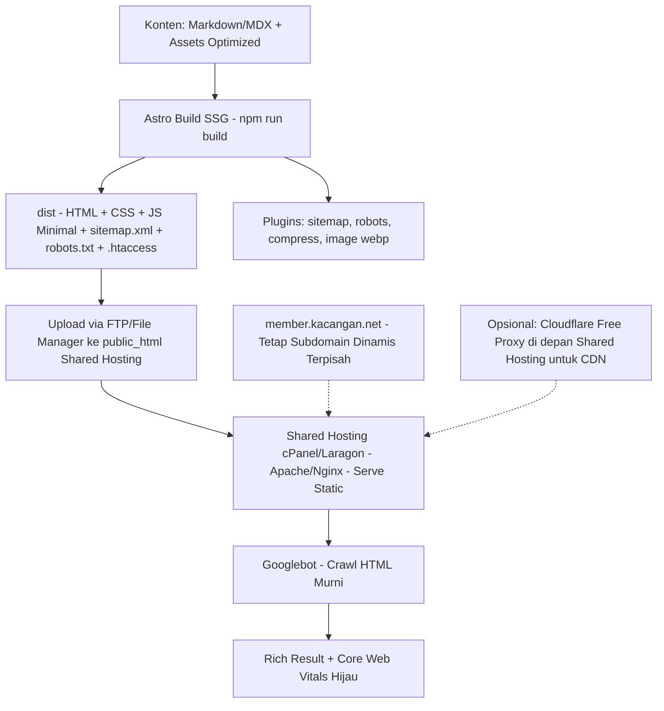

# Plan: Migrasi Landing Page KCNET Menjadi Lebih SEO Friendly — Shared Hosting

> Fokus: SEO murni landing page marketing, konten jarang berubah, ranking keyword `VPN Remote / Mikrotik`, performa tinggi, biaya minimal, **deploy ke shared hosting (cPanel / Laragon) via FTP — tanpa server Node.js**.

## 1. Ringkasan Eksekutif & Jawaban Pertanyaanmu

**Pertanyaan: `cocoknya pakai apa? apakah SSR pakai React / Vue atau yang lain?`**

**Jawaban: JANGAN pakai SSR React / Vue untuk kasus ini, apalagi di shared hosting.**

*   **Kondisi saat ini:** [`index.html`](index.html:1) dan [`vpn-remot.html`](vpn-remot.html:1) adalah HTML statis hasil Mobirise. Sudah *crawlable* Google (bukan CSR), jadi SSR tidak menambah nilai SEO. Masalah utama adalah *on-page SEO & performa*, bukan *rendering*.
*   **SSR Next.js / Nuxt butuh Node.js server** (Vercel, VPS, `node server.js`). **Shared hosting tidak support Node** — akan gagal deploy & biaya membengkak. SSR juga menghambat Core Web Vitals karena hydration JS berat.
*   **Rekomendasi untuk shared hosting:** **SSG Astro + Tailwind CSS (output statis murni)**.
    *   `npm run build` lokal menghasilkan folder `dist/` berisi `index.html`, `vpn-remote/index.html`, `sitemap.xml`, `robots.txt`, `.htaccess` — tinggal upload via FTP ke `public_html`. 100% kompatibel dengan hosting lamamu.
    *   0 JS by default → Lighthouse 95+ → ranking factor Google.
    *   Tetap bisa pakai komponen React / Vue sebagai *island* jika butuh interaktivitas nanti (misal kalkulator harga) tanpa membebani seluruh halaman.
    *   DX modern, plugin SEO matang (`@astrojs/sitemap`, `astro-robots-txt`).

> Fallback jika tim memaksa React: `Next.js` dengan `output: 'export'` (SSG, bukan SSR). Jika tim Vue: `Nuxt` dengan `nuxi generate` (SSG). Keduanya tetap menghasilkan `dist/` statis untuk shared hosting — tapi Astro lebih ringan & cepat.

## 2. Audit SEO Teknis Saat Ini (Temuan)

Berdasarkan inspeksi [`index.html`](index.html:1), [`vpn-remot.html`](vpn-remot.html:1), [`product.html`](product.html:1), dan struktur [`list_files`](.:true):

### 2.1 Yang Sudah Oke
*   HTML statis → Google bisa crawl tanpa JS.
*   Ada `meta description` & `keywords` di [`index.html`](index.html:9), `viewport` responsive.
*   Heading `h1` ada.

### 2.2 Yang Harus Diperbaiki (Critical)
*   **Tidak ada `sitemap.xml` & `robots.txt`:** Tidak ditemukan di root → Google meraba-raba URL.
*   **Tidak ada `canonical`, `og:*`, `twitter:*` konsisten:** Hanya [`product.html`](product.html:7) punya OG/Twitter, halaman lain kosong → preview di WA/FB jelek & duplikasi konten.
*   **Tidak ada Structured Data JSON-LD:** Tidak ada `Organization`, `Service`, `FAQPage`, `BreadcrumbList` → kehilangan rich result.
*   **Heading hierarchy berantakan:** `h1` ada 2x, `h2`/`h3` tidak semantik.
*   **Performa Berat:** Load `jquery.min.js`, `bootstrap.min.js`, `tether.min.js`, `jarallax.min.js`, `smooth-scroll.js`, `mbr-additional.css` di semua halaman → JS ~300KB+, CSS tidak di-purge, tidak ada `preload` font, image `background2.jpg` tidak di-optimize/`srcset`/`webp`.
*   **Image SEO:** `alt=""` kosong di [`index.html`](index.html:303), nama file tidak deskriptif.
*   **URL tidak SEO-friendly:** `vpn-remot.html`, `cloud-userman.html` → lebih baik `/vpn-remote/` (tanpa `.html`, slug baku). Tidak ada breadcrumb / internal linking.
*   **Meta duplikat & tipis:** [`vpn-remot.html`](vpn-remot.html:9) `description="VPN Remot"` terlalu pendek, `title` tidak mengandung keyword long-tail.
*   **No `.htaccess` SEO:** Tidak ada 301, force HTTPS, compress, cache, `404.html` custom.

### 2.3 Dampak ke Ranking
Untuk keyword kompetitif `vpn remote mikrotik`, `solusi ip publik indihome`, kalah di Core Web Vitals & *on-page relevance*.

## 3. Perbandingan Opsi Stack untuk Shared Hosting

| Kriteria | Opsi A: Optimasi HTML Manual | Opsi B: SSG Astro + Tailwind (REKOMENDASI) | Opsi C: SSG Eleventy / Hugo | Opsi D: SSR Next.js (React) | Opsi E: SSR Nuxt (Vue) |
|---|---|---|---|---|---|
| **Output** | HTML statis | HTML statis + 0 JS, terbaik | HTML statis | SSR butuh Node | SSR butuh Node |
| **Core Web Vitals** | Sedang | **Excellent (99 Lighthouse)** | Excellent | Buruk jika hydration besar | Buruk |
| **Kompatibel Shared Hosting?** | Ya | **Ya (dist/ via FTP)** | Ya | **TIDAK (butuh Node server)** | **TIDAK** |
| **Biaya Hosting** | Murah | **Murah (tetap hosting lama)** | Murah | Mahal (VPS/Vercel) | Mahal |
| **Maintenance** | Sulit (copy-paste header) | Mudah (component, layout) | Mudah | Kompleks | Kompleks |
| **Cocok untuk kasus ini?** | Short-term patch | **YA, paling cocok** | Ya, alternatif | Overkill + tidak jalan di shared hosting | Overkill + tidak jalan |

**Keputusan:** Pilih **B**. SSR React/Vue tidak viable di shared hosting.

## 4. Arsitektur Rekomendasi untuk Shared Hosting (Astro SSG)



### 4.1 Struktur Project Baru (dibuild lokal, `dist/` di-upload)

```
kacangan-astro/
├── src/
│   ├── components/
│   │   ├── Header.astro
│   │   ├── Footer.astro
│   │   ├── Hero.astro
│   │   ├── FeatureCard.astro
│   │   └── FAQ.astro
│   ├── layouts/
│   │   ├── BaseLayout.astro  // <head> SEO, OG, JSON-LD, canonical
│   │   └── MDLayout.astro
│   ├── pages/
│   │   ├── index.astro              // / -> dist/index.html
│   │   ├── vpn-remote/index.astro   // /vpn-remote/ -> dist/vpn-remote/index.html
│   │   ├── cloud-userman/index.astro
│   │   ├── jasa-setting-mikrotik/index.astro
│   │   ├── template-hotspot/index.astro
│   │   ├── pembayaran/index.astro
│   │   ├── privasi/index.astro
│   │   └── 404.astro                // -> dist/404.html (ErrorDocument)
│   ├── content/
│   │   └── services/
│   └── styles/
│       └── global.css // Tailwind
├── public/
│   ├── robots.txt
│   ├── .htaccess        // akan di-generate ke dist/.htaccess
│   ├── ads.txt
│   ├── google1007f095cb942424.html
│   ├── favicon.png
│   └── images/ (source, akan di-optimize ke webp/avif saat build)
├── astro.config.mjs // site: https://kacangan.net, output: static, integrations: sitemap, robotsTxt
└── package.json
```

**Routing & Redirect 301 (wajib untuk SEO juice):**
Buat `public/.htaccess` (Astro copy ke `dist/.htaccess`):
```
RewriteEngine On
# Redirect URL lama .html ke URL baru tanpa .html
Redirect 301 /vpn-remot.html /vpn-remote/
Redirect 301 /cloud-userman.html /cloud-userman/
Redirect 301 /template-hotspot.html /template-hotspot/
# Force HTTPS + non-www konsisten
RewriteCond %{HTTPS} off [OR]
RewriteCond %{HTTP_HOST} ^www\. [NC]
RewriteRule ^ https://kacangan.net%{REQUEST_URI} [R=301,L]
# Compress & Cache (mod_deflate/mod_expires)
# ErrorDocument 404 /404.html
```
Jika ingin tetap pakai `.html` untuk kompatibilitas, Astro bisa `build.format: file` → `vpn-remote.html` — tapi disarankan pindah ke clean URL + 301.

### 4.2 Hosting & Deploy Workflow untuk Shared Hosting

*   **Build Lokal (paling simpel):**
    1. `npm run build` di laptop → `dist/`
    2. Upload `dist/*` via FTP (FileZilla) / File Manager cPanel ke `public_html` (overwrite).
    3. Tidak butuh Node di server, tidak butuh `npm install` di server.
*   **Build via GitHub Actions + FTP (opsional, semi-otomatis):**
    *   Push ke GitHub → Action `npm run build` → deploy via `SamKirkland/FTP-Deploy-Action` ke shared hosting. Tetap statis, tidak butuh Node di server.
*   **SSL:** Pakai AutoSSL / Let's Encrypt di cPanel (gratis).
*   **Opsional CDN Gratis tanpa pindah hosting:** Aktifkan Cloudflare Free (ganti NS ke CF, proxy orange cloud) → tetap hosting di tempat lama tapi dapat edge cache + HTTP/3. Tidak wajib, tapi bantu LCP.
*   **Hindari:** Deploy SSR Next/Nuxt ke shared hosting — tidak akan jalan.

## 5. Rencana Migrasi Konten dari Mobirise

1.  **Inventory:** List semua file di [`list_files`](.:true) → mapping URL lama → URL baru (clean URL).
2.  **Ekstrak Konten:** Copy teks dari [`index.html`](index.html:82) hero, [`vpn-remot.html`](vpn-remot.html:78) deskripsi layanan ke komponen Astro / Markdown. Hapus class `cid-rZB...` Mobirise.
3.  **Design Token:** Ganti Bootstrap 4 + Mobirise CSS dengan Tailwind CSS. Buat `Header.astro` & `Footer.astro` sekali, reuse (hilangkan duplikasi nav di tiap HTML).
4.  **Image:** Convert `assets/images/*.jpg` ke `webp`/`avif` via `astro:assets`, tambah `width`/`height` & `alt` deskriptif (`alt="Setting Mikrotik untuk RT RW Net"`), `loading="lazy"` kecuali hero LCP.
5.  **Preserve SEO Juice:** Buat `public/.htaccess` 301 & `public/_headers` jika pakai CF.

## 6. Implementasi SEO On-Page & Teknis (Checklist untuk Code Mode)

### 6.1 Head & Meta (di `BaseLayout.astro`)
*   `title` unik 50-60 char, keyword di depan: `VPN Remote MikroTik Tanpa IP Publik | KCNET`
*   `meta description` unik 150-160 char
*   `link rel=canonical` absolut `https://kacangan.net/vpn-remote/`
*   `og:title`, `og:description`, `og:image` (1200x630), `og:type`, `og:url`, `twitter:card`
*   `link rel=icon`, `theme-color #666DE3`, `preconnect` font

### 6.2 Structured Data JSON-LD
*   `Organization` (logo, sameAs sosmed)
*   `Service` untuk tiap layanan (VPN Remote, Cloud Userman, Jasa Setting Mikrotik)
*   `FAQPage` & `BreadcrumbList`
*   Validasi di https://validator.schema.org/

### 6.3 Sitemap & Robots
*   `@astrojs/sitemap` → `sitemap.xml` otomatis dari `src/pages`
*   `astro-robots-txt` → `robots.txt` allow all, sitemap reference
*   Submit sitemap ke Google Search Console + Bing Webmaster, pertahankan `google1007f095cb942424.html`

### 6.4 Performa (Core Web Vitals) — Fokus Shared Hosting
*   Tailwind purge + `astro-compress` (HTML/CSS/JS minify)
*   `astro:assets` image optimization (webp, srcset)
*   Hapus jQuery, Bootstrap JS, Jarallax → ganti CSS native / minimal JS
*   Font `display=swap`, preload critical CSS
*   `.htaccess`: `mod_deflate` (gzip/brotli) + `mod_expires` (cache 1 year untuk assets ber-hash)
*   Target: LCP <2.5s, CLS 0, INP <200ms

### 6.5 Konten & Internal Linking
*   1 `h1` per page, `h2` section, `h3` card
*   Keyword mapping: `index` → `jasa setting mikrotik`, `vpn-remote` → `vpn remote mikrotik tanpa ip publik`
*   Tambah FAQ & CTA (`Konsultasi Gratis via WA 082324129752`) dengan anchor relevan
*   Breadcrumb + related services

### 6.6 Monitoring
*   Google Search Console, GA4, `ads.txt` tetap di `public/ads.txt`
*   Lighthouse CI (bisa jalan lokal `npm run preview` + Lighthouse)

## 7. Fase Implementasi (Tanpa Estimasi Waktu)

**Fase 0 - Setup:**
*   Init `npm create astro@latest`, install `tailwindcss`, `@astrojs/sitemap`, `astro-robots-txt`, `astro-compress`, `sharp`. Set `astro.config.mjs` `site: https://kacangan.net`, `output: static`.

**Fase 1 - Fondasi:**
*   Buat `BaseLayout.astro`, `Header.astro`, `Footer.astro`, `public/.htaccess` template.

**Fase 2 - Migrasi Halaman:**
*   Migrasi `index.astro`, `vpn-remote`, `cloud-userman`, `layanan`, `pembayaran`, `privasi`, `product`, `template-hotspot` (prioritas by traffic).

**Fase 3 - SEO & Performa:**
*   Implementasi meta, OG, canonical, JSON-LD, sitemap, robots, image optimization, redirect 301 di `.htaccess`.

**Fase 4 - QA & Deploy Shared Hosting:**
*   Validasi HTML, cek broken link, test OG di https://www.opengraph.xyz/, Lighthouse, `npm run build` → upload `dist/` via FTP → test 301 & 404 di hosting.

**Fase 5 - Post-Launch:**
*   Submit sitemap GSC, monitor coverage, 301, Core Web Vitals, ranking keyword.

## 8. Pertanyaan Final Sebelum Code Mode (Shared Hosting Path)

1.  Setuju pakai **Astro SSG + Tailwind, output `dist/` statis untuk upload FTP ke shared hosting**? Atau prefer `Next.js output: export` / `Nuxt generate` tetap SSG?
2.  URL baru **clean URL tanpa `.html` (`/vpn-remote/`) + 301 dari `.html` lama** disetujui? Atau harus tetap `.html` (Astro `build.format: file`)?
3.  Deployment **manual FTP** atau **GitHub Actions auto FTP**? Punya akses cPanel/FTP untuk dicoba?
4.  Konten dikelola via **Markdown/MDX (developer)** atau butuh CMS headless untuk non-teknis?

---
Setelah disetujui, switch ke `code` mode untuk eksekusi Fase 0-2 (generate project Astro yang siap upload ke shared hosting).
